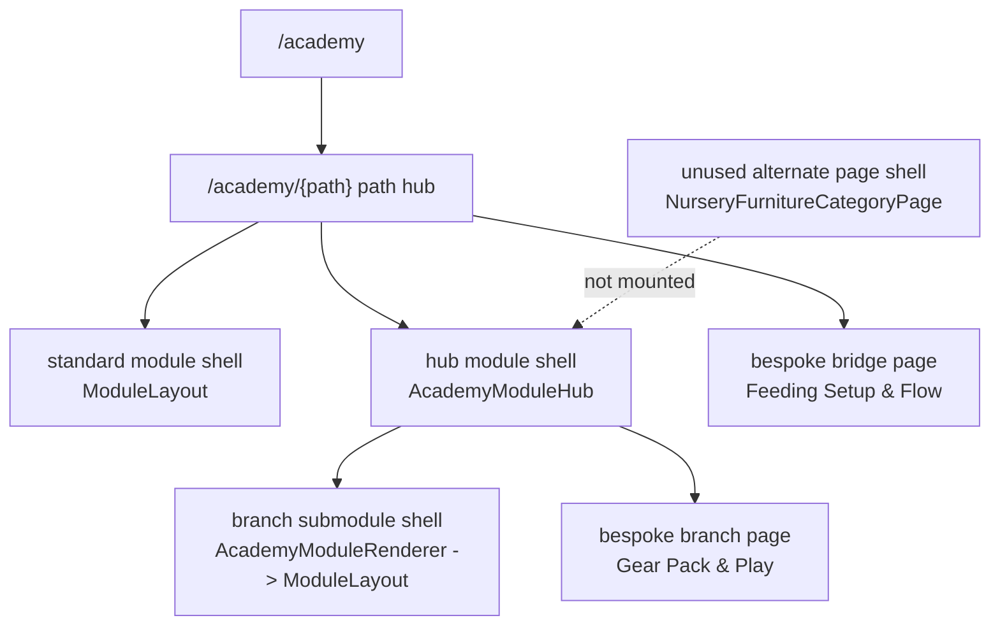

# TMBC Academy System Audit

Date: April 16, 2026

Scope: live Academy code in `app/academy/**`, `components/academy/**`, `lib/academy/**`, shared navigation shells, and route-adjacent logic.

This is a current-state system audit, not a redesign proposal.

## 1. Academy Inventory

### Snapshot

- Live Academy routes: 63
- Academy home routes: 1
- Path hubs: 4
- Top-level Academy modules: 29
- Standard core modules: 23
- Hub modules: 5
- Typed bridge modules: 1
- Branch submodules: 29
- Bespoke Academy pages outside the shared `ModuleLayout` path: 2
- Unused alternate Academy page implementation: 1

### Rendering Patterns

1. Academy home: `/academy`
2. Path hubs: `/academy/{path}`
3. Standard modules: dynamic `[academyPath]/[module]` route using `ModuleLayout`
4. Hub modules: dedicated routes using `AcademyModuleHub`
5. Branch submodules: dedicated routes that usually hydrate into `AcademyModuleRenderer -> ModuleLayout`
6. Bespoke pages: `/academy/gear/feeding-setup-flow`, `/academy/gear/daily-use-gear/pack-and-play`

### Academy Home

- Route: `/academy`
- Purpose: entry point into the four-path system
- Current behavior: strong path selection UI, but always leads with `Start with Registry`

### Registry Path

- Path name: Registry
- Path route: `/academy/registry`
- Path hub purpose: build the registry in order from essentials to platform, support, perks, timing, cleanup, and gifting

#### Core modules

| # | Title | Route | Type | Submodules | Next-link clarity | Current posture |
| --- | --- | --- | --- | --- | --- | --- |
| 1 | What to Register First | `/academy/registry/what-to-register-first` | Standard module | No | Strong | Decision-first |
| 2 | Where to Register | `/academy/registry/where-to-register` | Standard module | No | Adequate | Decision-first |
| 3 | Shop Local & Get Support | `/academy/registry/shop-local-get-support` | Standard module | No | Adequate | Hybrid |
| 4 | Welcome Boxes & Registry Perks | `/academy/registry/welcome-boxes-perks` | Hub module | Yes | Strong inside hub, weak across system | Hybrid |
| 5 | Loyalty, Rewards & Completion Discounts | `/academy/registry/rewards-completion-discounts` | Standard module | No | Adequate | Decision-first |
| 6 | Smart Purchasing Timeline | `/academy/registry/smart-purchasing-timeline` | Standard module | No | Adequate | Decision-first |
| 7 | Registry Mistakes to Avoid | `/academy/registry/mistakes-to-avoid` | Standard module | No | Strong | Editorial bridge behavior, not coded as bridge |
| 8 | Baby Showers & Gifting Strategy | `/academy/registry/baby-showers-gifting` | Standard module | No | Weak | Hybrid |

#### Hub branch: Welcome Boxes & Registry Perks

| Title | Route | Type | Parent path | Parent hub | Next-link clarity | Current posture |
| --- | --- | --- | --- | --- | --- | --- |
| Target Welcome Kit | `/academy/registry/welcome-boxes-perks/target` | Branch submodule | Registry | Welcome Boxes & Registry Perks | Partial | Comparative / informational |
| Babylist Hello Baby Box | `/academy/registry/welcome-boxes-perks/babylist` | Branch submodule | Registry | Welcome Boxes & Registry Perks | Partial | Comparative / informational |
| Amazon Welcome Box | `/academy/registry/welcome-boxes-perks/amazon` | Branch submodule | Registry | Welcome Boxes & Registry Perks | Partial | Comparative / informational |
| MacroBaby Registry Gift Box | `/academy/registry/welcome-boxes-perks/macrobaby` | Branch submodule | Registry | Welcome Boxes & Registry Perks | Adequate | Comparative / decision support |

### Nursery Path

- Path name: Nursery
- Path route: `/academy/nursery`
- Path hub purpose: build the room around real use, then sort sleep, furniture, flow, storage, and atmosphere

#### Core modules

| # | Title | Route | Type | Submodules | Next-link clarity | Current posture |
| --- | --- | --- | --- | --- | --- | --- |
| 1 | Vision & Lifestyle Foundations | `/academy/nursery/vision-and-lifestyle` | Standard module | No | Strong | Decision-first foundation |
| 2 | Sleep Space Decisions | `/academy/nursery/sleep-space-decisions` | Standard module | No | Strong | Decision-first |
| 3 | Furniture That Actually Works | `/academy/nursery/furniture-that-actually-works` | Hub module | Yes | Strong inside hub, partial across paths | Decision-first |
| 4 | Layout & Flow | `/academy/nursery/layout-and-flow` | Standard module | No | Adequate | Decision-first |
| 5 | Storage & Organization | `/academy/nursery/storage-and-organization` | Standard module | No | Adequate | Hybrid |
| 6 | Atmosphere & Safety | `/academy/nursery/atmosphere-and-safety` | Standard module | No | Weak | Hybrid / finishing layer |

#### Hub branch: Furniture That Actually Works

| Title | Route | Type | Parent path | Parent hub | Next-link clarity | Current posture |
| --- | --- | --- | --- | --- | --- | --- |
| Cribs | `/academy/nursery/furniture-that-actually-works/cribs` | Branch submodule | Nursery | Furniture That Actually Works | Adequate | Decision-first |
| Pack & Play | `/academy/nursery/furniture-that-actually-works/pack-and-play` | Branch submodule | Nursery | Furniture That Actually Works | Adequate | Decision-first |
| Gliders | `/academy/nursery/furniture-that-actually-works/gliders` | Branch submodule | Nursery | Furniture That Actually Works | Adequate | Decision-first |
| Dressers & Changing | `/academy/nursery/furniture-that-actually-works/dressers-changing` | Branch submodule | Nursery | Furniture That Actually Works | Adequate | Decision-first |
| Diaper Pails | `/academy/nursery/furniture-that-actually-works/diaper-pails` | Branch submodule | Nursery | Furniture That Actually Works | Adequate | Decision-first |
| Baby Monitors | `/academy/nursery/furniture-that-actually-works/baby-monitors` | Branch submodule | Nursery | Furniture That Actually Works | Adequate | Decision-first |
| Baby Proofing | `/academy/nursery/furniture-that-actually-works/baby-proofing` | Branch submodule | Nursery | Furniture That Actually Works | Weak | Hybrid / endcap |

### Gear Path

- Path name: Gear
- Path route: `/academy/gear`
- Path hub purpose: teach category logic before shortlist logic, then move through transport, daily-use gear, and feeding systems

#### Core modules

| # | Title | Route | Type | Submodules | Next-link clarity | Current posture |
| --- | --- | --- | --- | --- | --- | --- |
| 1 | How to Think About Baby Gear | `/academy/gear/how-to-think-about-baby-gear` | Standard module | No | Strong | Decision-first foundation |
| 2 | Stroller Foundations | `/academy/gear/stroller-foundations` | Hub module | Yes | Strong inside hub, partial across system | Decision-first |
| 3 | Car Seat Foundations | `/academy/gear/car-seat-foundations` | Hub module | Yes | Strong inside hub, partial across system | Decision-first |
| 4 | Travel Systems | `/academy/gear/travel-systems` | Standard module | No | Strong | Decision-first |
| 5 | Travel With Baby | `/academy/gear/travel-with-baby` | Standard module | No | Adequate | Hybrid / editorial |
| 6 | Daily Use Gear | `/academy/gear/daily-use-gear` | Hub module | Yes | Strong inside hub, partial across system | Decision-first |
| 7 | Feeding Setup & Flow | `/academy/gear/feeding-setup-flow` | Editorial bridge module | No | Strong | Bridge module |
| 8 | Breast Pump | `/academy/gear/breast-pump` | Standard module | No | Strong | Decision-first |
| 9 | Bottles & Baby Utensils | `/academy/gear/bottles-and-baby-utensils` | Standard module | No | Adequate | Decision-first |

#### Hub branch: Stroller Foundations

| Title | Route | Type | Parent path | Parent hub | Next-link clarity | Current posture |
| --- | --- | --- | --- | --- | --- | --- |
| Full Size & Modular | `/academy/gear/stroller-foundations/full-size-modular-strollers` | Branch submodule | Gear | Stroller Foundations | Strong | Decision-first |
| Compact | `/academy/gear/stroller-foundations/compact-lightweight-strollers` | Branch submodule | Gear | Stroller Foundations | Strong | Decision-first |
| Travel | `/academy/gear/stroller-foundations/travel-strollers` | Branch submodule | Gear | Stroller Foundations | Strong | Decision-first |
| Convertible | `/academy/gear/stroller-foundations/convertible-strollers` | Branch submodule | Gear | Stroller Foundations | Strong | Decision-first |
| Jogging | `/academy/gear/stroller-foundations/jogging-all-terrain-strollers` | Branch submodule | Gear | Stroller Foundations | Strong | Decision-first |
| Double | `/academy/gear/stroller-foundations/double-strollers` | Branch submodule | Gear | Stroller Foundations | Strong | Decision-first |

#### Hub branch: Car Seat Foundations

| Title | Route | Type | Parent path | Parent hub | Next-link clarity | Current posture |
| --- | --- | --- | --- | --- | --- | --- |
| Infant Car Seats | `/academy/gear/car-seat-foundations/infant-car-seats` | Branch submodule | Gear | Car Seat Foundations | Strong | Decision-first |
| Convertible Car Seats | `/academy/gear/car-seat-foundations/convertible-car-seats` | Branch submodule | Gear | Car Seat Foundations | Strong | Decision-first |
| All-in-One Car Seats | `/academy/gear/car-seat-foundations/all-in-one-car-seats` | Branch submodule | Gear | Car Seat Foundations | Strong | Decision-first |
| Booster Seats | `/academy/gear/car-seat-foundations/booster-seats` | Branch submodule | Gear | Car Seat Foundations | Strong | Decision-first |
| Rotating Car Seats | `/academy/gear/car-seat-foundations/rotating-car-seats` | Branch submodule | Gear | Car Seat Foundations | Strong | Decision-first |
| Travel & Lightweight Car Seats | `/academy/gear/car-seat-foundations/travel-lightweight-car-seats` | Branch submodule | Gear | Car Seat Foundations | Strong | Decision-first |

#### Hub branch: Daily Use Gear

| Title | Route | Type | Parent path | Parent hub | Next-link clarity | Current posture |
| --- | --- | --- | --- | --- | --- | --- |
| Carrier | `/academy/gear/daily-use-gear/carrier` | Branch submodule | Gear | Daily Use Gear | Adequate | Decision-first |
| Highchair | `/academy/gear/daily-use-gear/highchair` | Branch submodule | Gear | Daily Use Gear | Adequate | Decision-first |
| Baby Bath | `/academy/gear/daily-use-gear/baby-bath` | Branch submodule | Gear | Daily Use Gear | Adequate | Decision-first |
| Pack & Play | `/academy/gear/daily-use-gear/pack-and-play` | Branch submodule, bespoke implementation | Gear | Daily Use Gear | Weak | Special editorial page |
| Swing / Bouncer | `/academy/gear/daily-use-gear/swing-bouncer` | Branch submodule | Gear | Daily Use Gear | Adequate | Decision-first |
| Daily Support Gear | `/academy/gear/daily-use-gear/daily-support-gear` | Branch submodule | Gear | Daily Use Gear | Weak | Hybrid / endcap |

### Postpartum Path

- Path name: Postpartum
- Path route: `/academy/postpartum`
- Path hub purpose: make the adult side of early parenthood sequenced and visible across recovery, home rhythm, feeding, rest, emotional change, and support

#### Core modules

| # | Title | Route | Type | Submodules | Next-link clarity | Current posture |
| --- | --- | --- | --- | --- | --- | --- |
| 1 | Healing & Recovery | `/academy/postpartum/healing-and-recovery` | Standard module | No | Adequate | Informational / support |
| 2 | First-Weeks Home Rhythm | `/academy/postpartum/first-weeks-home-rhythm` | Standard module | No | Strong | Decision-first |
| 3 | Feeding & Lactation | `/academy/postpartum/feeding-and-lactation` | Standard module | No | Adequate | Hybrid |
| 4 | Rest & Sleep | `/academy/postpartum/rest-and-sleep` | Standard module | No | Adequate | Hybrid |
| 5 | Emotional Wellness & Identity | `/academy/postpartum/emotional-wellness-and-identity` | Standard module | No | Adequate | Informational / support |
| 6 | Support Systems | `/academy/postpartum/support-systems` | Standard module | No | Weak | Actionable, but misplaced and under-bridged |

### Structural Notes

- `feeding-setup-flow` is the only top-level module explicitly typed as a bridge.
- Five top-level modules branch into hub pages: stroller, car seat, daily use gear, nursery furniture, welcome boxes.
- `app/academy/gear/daily-use-gear/pack-and-play/page.tsx` is a bespoke branch page and does not use the shared module shell.
- `components/academy/NurseryFurnitureCategoryPage.tsx` is an unused alternate implementation, which suggests IA drift.
- `next.config.js` contains multiple Academy redirect aliases, which suggests the taxonomy has already shifted at least once.

## 2. Current Wireframe

### Route Tree

```text
/academy
  /academy/registry
    1 /what-to-register-first
    2 /where-to-register
    3 /shop-local-get-support
    4 /welcome-boxes-perks  [hub]
      /target
      /babylist
      /amazon
      /macrobaby
    5 /rewards-completion-discounts
    6 /smart-purchasing-timeline
    7 /mistakes-to-avoid
    8 /baby-showers-gifting

  /academy/nursery
    1 /vision-and-lifestyle
    2 /sleep-space-decisions
    3 /furniture-that-actually-works  [hub]
      /cribs
      /pack-and-play
      /gliders
      /dressers-changing
      /diaper-pails
      /baby-monitors
      /baby-proofing
    4 /layout-and-flow
    5 /storage-and-organization
    6 /atmosphere-and-safety

  /academy/gear
    1 /how-to-think-about-baby-gear
    2 /stroller-foundations  [hub]
      /full-size-modular-strollers
      /compact-lightweight-strollers
      /travel-strollers
      /convertible-strollers
      /jogging-all-terrain-strollers
      /double-strollers
    3 /car-seat-foundations  [hub]
      /infant-car-seats
      /convertible-car-seats
      /all-in-one-car-seats
      /booster-seats
      /rotating-car-seats
      /travel-lightweight-car-seats
    4 /travel-systems
    5 /travel-with-baby
    6 /daily-use-gear  [hub]
      /carrier
      /highchair
      /baby-bath
      /pack-and-play  [bespoke page]
      /swing-bouncer
      /daily-support-gear
    7 /feeding-setup-flow  [bridge]
    8 /breast-pump
    9 /bottles-and-baby-utensils

  /academy/postpartum
    1 /healing-and-recovery
    2 /first-weeks-home-rhythm
    3 /feeding-and-lactation
    4 /rest-and-sleep
    5 /emotional-wellness-and-identity
    6 /support-systems
```

### Current Page Shell Map



### Current Cross-Path Bridges Encoded In Code

- Registry `What to Register First` -> Gear `How to Think About Baby Gear`
- Registry `Registry Mistakes to Avoid` -> Gear `Daily Use Gear`
- Registry `Baby Showers & Gifting Strategy` -> Gear `Stroller Foundations`
- Nursery `Vision & Lifestyle Foundations` -> Registry `Where to Register`
- Nursery `Layout & Flow` -> Postpartum `Healing & Recovery`
- Nursery `Storage & Organization` -> Postpartum `Feeding & Lactation`
- Nursery `Atmosphere & Safety` -> Gear `Stroller Foundations`
- Gear `How to Think About Baby Gear` -> Registry `Where to Register`
- Gear `Daily Use Gear` -> Registry `Where to Register`
- Gear `Feeding Setup & Flow` -> Postpartum `Feeding & Lactation`
- Gear `Breast Pump` -> Postpartum `Feeding & Lactation`
- Gear `Bottles & Baby Utensils` -> Postpartum `Feeding & Lactation`
- Postpartum `Healing & Recovery` -> Nursery `Layout & Flow`
- Postpartum `First-Weeks Home Rhythm` -> Gear `Feeding Setup & Flow`
- Postpartum `Rest & Sleep` -> Nursery `Sleep Space Decisions`
- Postpartum `Support Systems` -> Registry `Shop Local & Get Support`

### Where The Current Wireframe Breaks

- Path hubs show the full module list. Most module pages do not.
- Branch hubs show submodules. They do not show the full parent-path sequence.
- Branch submodules use `Module x of y` progress for the branch itself, not the larger path.
- Only five routes surface `AcademyJourneyNavigator`: the four path hubs and `feeding-setup-flow`.
- `pack-and-play` inside Daily Use Gear is a one-off page with its own UX pattern and no branch reintegration.

## 3. Audit Findings

### A. Redundant Or Overlapping Concepts

1. Pack-and-play appears in three places with fuzzy role separation.
   - `Nursery > Sleep Space Decisions`
   - `Nursery > Furniture That Actually Works > Pack & Play`
   - `Gear > Daily Use Gear > Pack & Play`
   - Current problem: one concept is being asked to do room-sharing sleep, portable sleep, backup sleep, and daily-use flexibility without a clear “this page is about X, not Y” boundary.

2. Feeding is split across Gear and Postpartum without a clean role handoff.
   - `Feeding Setup & Flow`
   - `Breast Pump`
   - `Bottles & Baby Utensils`
   - `Postpartum > Feeding & Lactation`
   - Current problem: Gear handles setup and tools, Postpartum handles support and lived reality, but the split is not framed explicitly enough.

3. Registry support logic is spread across three modules.
   - `Where to Register`
   - `Shop Local & Get Support`
   - `Welcome Boxes & Registry Perks`
   - Current problem: platform choice, retailer value, local expert help, and perks all touch the same “where should this registry live?” question.

4. Nursery planning layers blur together.
   - `Vision & Lifestyle`
   - `Layout & Flow`
   - `Storage & Organization`
   - `Atmosphere & Safety`
   - Current problem: all four speak about calm, flow, real life, and night use. The role separation is not sharp enough.

5. Gear transport logic is spread across four modules with partial overlap.
   - `Stroller Foundations`
   - `Car Seat Foundations`
   - `Travel Systems`
   - `Travel With Baby`
   - Current problem: compatibility, portability, everyday routes, and outing logistics bleed into each other.

### B. Weak Transitions

1. `Baby Showers & Gifting Strategy` is the end of Registry, but it does not create a satisfying system handoff.
   - It has no forward module.
   - Its related jump to `Stroller Foundations` feels arbitrary rather than like a true “now do this next” move.

2. `Atmosphere & Safety` ends Nursery with a weak bridge.
   - It lands as a finishing layer, then points to `Stroller Foundations`.
   - The stronger next questions are actually `Rest & Sleep`, `First-Weeks Home Rhythm`, or a Nursery completion state.

3. `Support Systems` ends Postpartum too late and too softly.
   - Support belongs near the start of postpartum planning, not as a final reflection module.
   - The current end state is informational rather than operational.

4. Branch submodules are sequenced linearly, not by user question.
   - Example: Welcome box pages move Target -> Babylist -> Amazon -> MacroBaby.
   - That is content order, not decision order.

5. Daily Use Gear `Pack & Play` breaks the shared next-step pattern.
   - It has connected content cards, but not the shared `DecisionRouter`, connected path pills, or next/previous branch sequence.
   - It feels like a standalone article tucked inside the Academy.

6. Standard modules technically have a next-state shell, but most of it is generic.
   - `DecisionRouter` uses shallow defaults for most modules.
   - The section exists, but the handoff is often too generic to feel concierge-like.

### C. Missing Bridges

1. Registry to Gear is underpowered at the exact moment users need it most.
   - `What to Register First` should route into stroller, car seat, feeding, and daily-use decision checkpoints before the list hardens.

2. Nursery to Postpartum is structurally under-connected.
   - `Layout & Flow`, `Storage & Organization`, and `Atmosphere & Safety` all want to hand off into `First-Weeks Home Rhythm` and `Rest & Sleep`.
   - Current path-level connected pills do not surface Postpartum at all from Nursery.

3. Gear to Nursery is structurally under-connected.
   - Gear connected-path pills exclude Nursery entirely, even when the content overlaps with sleep space or room setup.

4. Postpartum to Nursery is also structurally under-connected.
   - Postpartum connected-path pills exclude Nursery, even though `Rest & Sleep` points directly to `Sleep Space Decisions`.

5. Registry timing does not bridge clearly into category-specific “buy now vs later” decisions.
   - `Smart Purchasing Timeline` should explicitly hand users to feeding, stroller, car seat, sleep-space, and daily-use layers.

6. Support content does not bridge strongly into human help.
   - `Shop Local & Get Support` and `Support Systems` should feel like adjacent parts of the same support ecosystem.

### D. Decision Gaps

1. `Travel With Baby` teaches, but the decision it resolves is still fuzzy.
   - It feels more like context than a narrowing tool.

2. `Healing & Recovery` and `Emotional Wellness & Identity` are supportive, but under-routed into actionable planning.
   - They teach what is true.
   - They do not strongly tell the user what to set up next.

3. `Storage & Organization` and `Atmosphere & Safety` explain the room well, but they need stronger prioritization logic.
   - What matters first
   - What can wait
   - What is overbought

4. Welcome box submodules explain retailers one by one, but do not offer a comparison checkpoint.
   - Users still have to infer the answer to “Which box or platform actually fits me?”

5. Branch submodules often assume the user already picked the right branch.
   - They explain the branch well.
   - They do less to confirm “you are in the right branch” or “go compare this other branch instead.”

### E. Sequence Issues

1. `Furniture That Actually Works` likely belongs after `Layout & Flow`, not before it.
   - Layout should set the room logic before furniture category deep dives.

2. `Support Systems` belongs earlier in Postpartum.
   - It should be a planning layer, not a closing thought.

3. `Travel With Baby` is over-weighted in the linear Gear path.
   - It reads more like a sidecar editorial bridge than a core pre-purchase module.

4. Feeding arrives late in the Gear path relative to its registry impact.
   - It matters much earlier than module 7 if the user is building a registry.

### F. Product Grounding Inconsistency

1. Standard shared modules usually have `Grounding Examples`.
2. Feeding uses strong system language but less concrete product-layer grounding than stroller or car seat.
3. Postpartum modules are light on grounding altogether.
4. The bespoke Gear `Pack & Play` page uses a separate “Taylor’s Top Picks” pattern and an affiliate placeholder instead of the shared product insight pattern.
5. Some Registry and Nursery pages are concept-rich but product-light, while Gear branches are concrete and example-rich.

## 4. Recommended Academy System Map

### What Stays

- The four-path architecture stays.
- The path hub model stays.
- The five hub modules stay.
- The stroller and car seat lane branches stay.
- The feeding bridge stays.
- The underlying decision-first tone stays.

### What Needs To Change Structurally

1. Keep one Academy shell across all routes.
   - Standardize bespoke pages into the same wayfinding pattern.
   - Keep the voice and layout differences if needed, but not the IA differences.

2. Make branch progress subordinate to path progress.
   - A stroller lane is not “Module 1 of 6” in the same sense as a core path module.
   - Show both: parent path position and branch position.

3. Put a persistent path map on every Academy page.
   - The user should always know:
   - where they are in the path
   - whether they are inside a branch
   - what the next core decision is

4. Replace generic “connected content” logic with module-aware decision bridges.
   - Generic guide/journal/service cards can stay as a secondary layer.
   - They should not be the main routing layer.

### Recommended Flow By Path

#### Registry

Recommended working flow:

`What to Register First -> Where to Register -> Shop Local & Get Support -> Welcome Boxes & Registry Perks -> Loyalty, Rewards & Completion Discounts -> Smart Purchasing Timeline -> Registry Mistakes to Avoid -> Baby Showers & Gifting Strategy`

What changes:

- Keep the core order.
- Add a Gear bridge immediately after `What to Register First`.
- Add a platform-decision router inside `Where to Register`.
- Make `Welcome Boxes & Registry Perks` a comparison hub, not just a stack of retailer pages.
- Make `Smart Purchasing Timeline` the main cross-path dispatch point into Gear and Nursery.
- Make `Baby Showers & Gifting Strategy` a completion-state router, not a soft ending.

#### Nursery

Recommended working flow:

`Vision & Lifestyle Foundations -> Sleep Space Decisions -> Layout & Flow -> Furniture That Actually Works -> Storage & Organization -> Atmosphere & Safety`

What changes:

- Reposition `Layout & Flow` ahead of `Furniture That Actually Works`.
- Keep `Sleep Space Decisions` as the main nursery decision checkpoint.
- Keep the furniture hub, but explicitly position it as branch depth after room logic is clearer.
- Make the back half of the path bridge into Postpartum, not back into Gear.

#### Gear

Recommended working flow:

`How to Think About Baby Gear -> Stroller Foundations -> Car Seat Foundations -> Travel Systems -> Daily Use Gear -> Feeding Setup & Flow -> Breast Pump -> Bottles & Baby Utensils`

`Travel With Baby` becomes an optional editorial bridge after `Travel Systems` and again after `Daily Use Gear`.

What changes:

- Keep stroller and car seat early.
- Keep travel systems as the compatibility layer.
- Move Daily Use Gear ahead of outing/travel editorial logic.
- Keep Feeding as a bridge, but surface it earlier from Registry and Postpartum.
- Recast `Travel With Baby` as optional, not mandatory.

#### Postpartum

Recommended working flow:

`Healing & Recovery -> Support Systems -> First-Weeks Home Rhythm -> Feeding & Lactation -> Rest & Sleep -> Emotional Wellness & Identity`

What changes:

- Move `Support Systems` to the front half of the path.
- Keep `First-Weeks Home Rhythm` as the operational center of the path.
- Let `Rest & Sleep` bridge back to Nursery.
- Let `Emotional Wellness & Identity` feel like a supported closing layer, not a detached essay.

### Route-Level Repositioning Summary

- Reposition `Layout & Flow` before `Furniture That Actually Works`.
- Reposition `Support Systems` before `First-Weeks Home Rhythm`.
- Recast `Travel With Baby` from mainline module to optional sidecar bridge.
- Treat `Smart Purchasing Timeline` as the main dispatch point into Gear and Nursery.

## 5. Bridge Strategy

### Registry -> Gear

| Bridge | Why this matters | User question carried across | Suggested UI pattern |
| --- | --- | --- | --- |
| `What to Register First -> How to Think About Baby Gear` | Parents should define big-ticket fit before locking those items into the registry. | “What actually deserves a place on my first-pass list?” | Next-step card |
| `Where to Register -> Stroller Foundations` | Platform choice depends on whether the list needs multiple retailers or specialty brands. | “Do my biggest gear decisions fit one retailer or a layered registry?” | Decision router |
| `Smart Purchasing Timeline -> Feeding Setup & Flow` | Feeding is one of the biggest buy-now vs later categories. | “What feeding tools belong now versus later?” | Inline handoff |
| `Registry Mistakes to Avoid -> Daily Use Gear` | Registry clutter usually comes from everyday categories being under-defined. | “Which routine products actually earn a place on the list?” | Connected content block |

### Nursery -> Sleep / Gear / Postpartum

| Bridge | Why this matters | User question carried across | Suggested UI pattern |
| --- | --- | --- | --- |
| `Sleep Space Decisions -> Rest & Sleep` | Sleep setup is not just a nursery question. It shapes adult rest and night rhythm. | “Will this setup make nights easier for us too?” | Next-step card |
| `Layout & Flow -> First-Weeks Home Rhythm` | Room routes need to support recovery, feeding, and resets in the first weeks home. | “Will this room still work when the whole house is tired?” | Inline handoff |
| `Storage & Organization -> Feeding & Lactation` | Feeding supplies and reset stations live inside room organization. | “Where do pump parts, bottles, and cloths actually go?” | Connected content block |
| `Nursery Pack & Play -> Gear Pack & Play` | Users need a clean split between sleep-space flexibility and travel portability. | “Am I solving room-sharing sleep, portability, or both?” | Decision router |
| `Atmosphere & Safety -> Rest & Sleep` | Light, noise, safety, and calm are really rest-support decisions. | “Is the next problem the room vibe, or the sleep rhythm it supports?” | Next-step card |

### Gear -> Registry / Postpartum / Nursery

| Bridge | Why this matters | User question carried across | Suggested UI pattern |
| --- | --- | --- | --- |
| `Stroller Foundations -> Smart Purchasing Timeline` | Once the lane is clear, timing becomes practical. | “Do I register this now, test it, or wait?” | Inline handoff |
| `Car Seat Foundations -> What to Register First` | Car seat planning belongs in first-pass essentials, but users need the fit lens first. | “Is this a day-one essential and which category belongs there?” | Next-step card |
| `Daily Use Gear -> First-Weeks Home Rhythm` | Daily-use gear only makes sense inside the routine it supports. | “What needs to be reachable every day in the house?” | Connected content block |
| `Gear Pack & Play -> Sleep Space Decisions` | This page currently acts like a standalone article; it should reconnect to the nursery sleep system. | “Is this a mobility decision or a whole sleep-plan decision?” | Next-step card |
| `Feeding Setup & Flow -> Feeding & Lactation` | Gear setup and lived feeding support must feel like one conversation. | “Do I need more tools, more support, or both?” | Decision router |

### Postpartum -> Gear / Nursery / Support

| Bridge | Why this matters | User question carried across | Suggested UI pattern |
| --- | --- | --- | --- |
| `Healing & Recovery -> Support Systems` | Recovery is where support stops being optional. | “Who is actually covering meals, logistics, and recovery support?” | Next-step card |
| `First-Weeks Home Rhythm -> Daily Use Gear` | Home rhythm exposes which products truly help the day. | “What setup change would make tomorrow easier?” | Connected content block |
| `Feeding & Lactation -> Feeding Setup & Flow` | Postpartum feeding should route back to the tool layer when needed. | “Is the issue support, setup, or overbuying?” | Decision router |
| `Rest & Sleep -> Sleep Space Decisions` | Sleep expectations and sleep geography must talk to each other. | “Is the problem the rhythm, the setup, or both?” | Inline handoff |
| `Support Systems -> Shop Local & Get Support` | The support ecosystem should connect content, local help, and services. | “Where do I get real human guidance next?” | Next-step card + service CTA |

## 6. Decision-First Recommendations

### High-Impact Additions By Module

#### Registry

- `What to Register First`
  - Add `Start Here`
  - Add `Most Common Path`
  - Add a `How to Decide` router: “Need gear help first?” -> Stroller / Car Seat / Feeding

- `Where to Register`
  - Add a simple `How to Decide` matrix:
  - one-store ease
  - universal flexibility
  - layered approach
  - Add `Taylor’s Take` with a clear default recommendation hierarchy

- `Shop Local & Get Support`
  - Add a decision block for:
  - local store support
  - virtual consult support
  - layered retailer + expert support
  - Add `Go here next` cards into `Welcome Boxes` and `Support Systems`

- `Welcome Boxes & Registry Perks`
  - Add `Most Common Path` tags to Target, Babylist, Amazon, MacroBaby
  - Add `Skip This for Now` marker if the user is only perk-chasing
  - Add a comparison checkpoint before submodule cards

- `Smart Purchasing Timeline`
  - Add `How to Decide` blocks by category:
  - buy now
  - register now
  - wait for baby
  - Add direct routing to `Sleep Space Decisions`, `Feeding Setup & Flow`, and `Daily Use Gear`

- `Registry Mistakes to Avoid`
  - Add a final edit checkpoint
  - Add `Go here next` into Daily Use Gear and Stroller Foundations

- `Baby Showers & Gifting Strategy`
  - Add a final path completion router:
  - “Need to clean up the list?”
  - “Need help with big-ticket gear?”
  - “Need nursery planning next?”

#### Nursery

- `Vision & Lifestyle Foundations`
  - Add `Start Here`
  - Add a room-type router:
  - dedicated nursery
  - shared room
  - small-space setup

- `Sleep Space Decisions`
  - Add `Most Common Path`
  - Add a decision block by sleep arrangement:
  - room-sharing
  - crib-first
  - mini-crib
  - pack-and-play

- `Furniture That Actually Works`
  - Add a problem-first router:
  - sleep
  - feeding
  - changing
  - containment
  - safety

- `Cribs` and `Pack & Play`
  - Add reciprocal handoffs
  - Add `Where to go next` cards to `Rest & Sleep` and `First-Weeks Home Rhythm`

- `Layout & Flow`
  - Add `Taylor’s Take` around the 2:14 AM route
  - Add a `How to Decide` block for placement priorities before styling

- `Storage & Organization`
  - Add `Skip This for Now` markers for overbuilt organization
  - Add a curated product layer around only the highest-friction items

- `Atmosphere & Safety`
  - Add a stronger exit router into `Rest & Sleep` and `Support Systems`
  - Add a `Most Common Path` marker for sound, light, and monitor basics

#### Gear

- `How to Think About Baby Gear`
  - Add `Start Here`
  - Add a one-screen “what kind of week do you actually have?” decision block

- `Stroller Foundations`
  - Add `Most Common Path` tags on lane cards
  - Add a branch confirmation block before users leave the hub

- `Car Seat Foundations`
  - Add `Most Common Path` tags on category cards
  - Add a stage-first comparison block before the category grid

- `Travel Systems`
  - Add a simple `How to Decide` checkpoint:
  - need infant click-in convenience
  - do not need click-in convenience

- `Travel With Baby`
  - Add `Skip This for Now`
  - Explicitly label it optional unless travel/outings are the live problem

- `Daily Use Gear`
  - Add a routine-first router:
  - carrying
  - feeding seat
  - bath
  - flexible sleep
  - soothing
  - house support

- `Gear Pack & Play`
  - Add `Where to Go Next` cards to:
  - `Swing / Bouncer`
  - `Nursery Pack & Play`
  - `Sleep Space Decisions`
  - `First-Weeks Home Rhythm`
  - Replace the affiliate placeholder with the shared product insight pattern

- `Feeding Setup & Flow`
  - Add an explicit registry timing handoff
  - Add `Most Common Path` and `Skip This for Now` markers by feeding pathway

- `Breast Pump`
  - Add `Start Here` when pumping is planned
  - Add `Skip This for Now` when pumping is hypothetical only

- `Bottles & Baby Utensils`
  - Add a `How to Decide` starter-count block
  - Add a `Go here next` router back to registry timing and postpartum feeding support

#### Postpartum

- `Healing & Recovery`
  - Add `Start Here`
  - Add a practical setup checklist rather than only supportive framing

- `Support Systems`
  - Move earlier in the path
  - Add a clear support-planning worksheet:
  - meals
  - visitors
  - nighttime help
  - emotional backup

- `First-Weeks Home Rhythm`
  - Add direct gear and nursery handoffs based on where friction shows up

- `Feeding & Lactation`
  - Add a triage router:
  - need support
  - need a different setup
  - need both

- `Rest & Sleep`
  - Add `How to Decide` around:
  - sleep expectations
  - sleep setup
  - support distribution

- `Emotional Wellness & Identity`
  - Add a stronger “what to do next” layer:
  - partner conversation
  - provider support
  - support-system check-in

## 7. Final Summary

### Top 5 Structural Strengths

1. The Academy already has a real top-level architecture: four clean paths instead of one undifferentiated content pile.
2. The strongest gear branches are genuinely useful. Stroller and car seat lane/category depth is real, not fake branching.
3. Most standard modules already use a decision-first shell with breadcrumbs, progress, decision framing, and next-step scaffolding.
4. The voice and editorial framing are strong enough to support a premium, concierge-style learning system.
5. The system already contains the ingredients of a connected engine: related links, submodule hubs, connected content, path pills, and decision routers.

### Top 5 Clarity Problems

1. Path context disappears once users leave the path hub.
2. Branch progress and path progress are conflated, which muddies where the user actually is.
3. Bespoke pages break shell consistency and make some routes feel outside the system.
4. Several major concepts overlap without a clearly stated role boundary.
5. Most “where to go next” states are present, but not specific enough to feel concierge-like.

### Top 5 Bridging Opportunities

1. Registry essentials -> Gear foundations
2. Nursery sleep/layout -> Postpartum rest/home rhythm
3. Feeding setup -> Postpartum feeding support
4. Gear category decisions -> Registry timing and buying
5. Support content -> human help, services, and local-store guidance

### Top 5 Highest-Impact Fixes

1. Put a persistent path map on every Academy page.
2. Show parent-path progress and branch progress separately.
3. Standardize all Academy routes on one navigation and next-step system.
4. Tighten the role separation around pack-and-play, feeding, and registry-platform support.
5. Replace generic end-of-module routing with module-aware bridge cards tied to the next real user question.

### Final Verdict

Current state:

- The Academy is functioning more like a curriculum with library leakage than a true decision system.
- It is more structured than a content library.
- It is not yet wired tightly enough to feel like one premium concierge planning engine.

Clearest path forward:

- Keep the four paths.
- Keep the hubs.
- Keep the branch depth.
- Standardize the shell.
- Put the path map everywhere.
- Reposition the few misordered modules.
- Add explicit bridge cards at the moments where one path naturally hands off to another.
- Treat each page less like “content completed” and more like “decision narrowed, next move obvious.”
