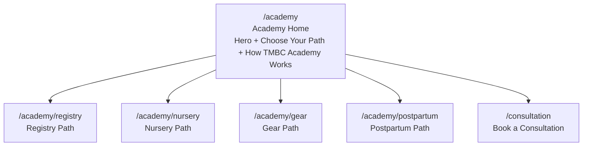
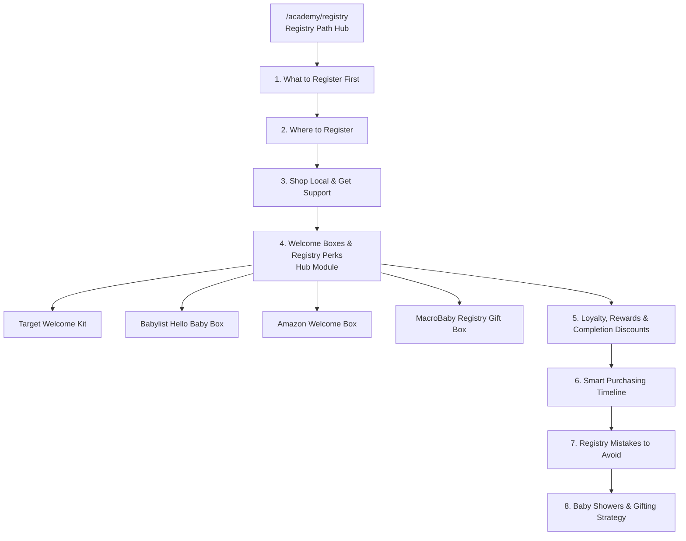
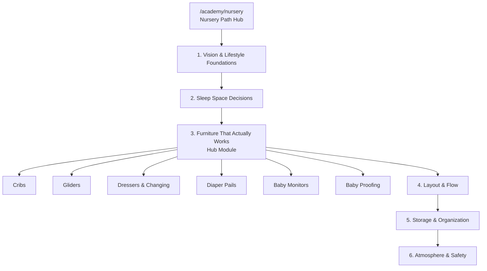
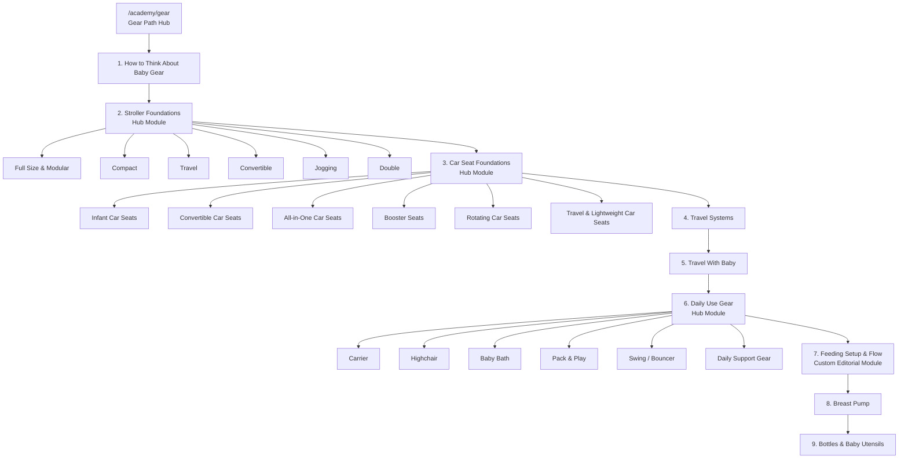
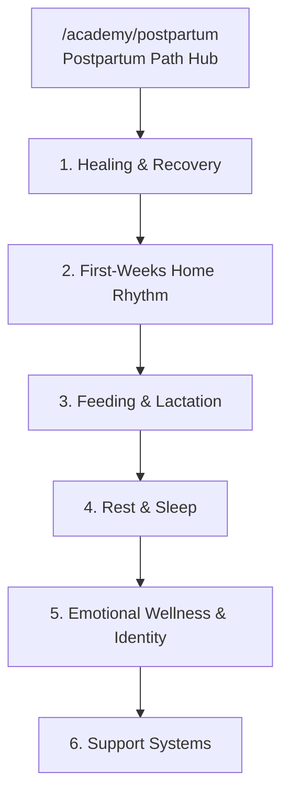

# TMBC Academy Wireframe

Generated from the live Academy route structure on `2026-04-05`.

This wireframe documents two things:

1. The full Academy information architecture.
2. The shared page-shell patterns the current Academy experience uses.

## Route Types

- `Academy home`
  - Route: `/academy`
  - File: `app/academy/page.tsx`
- `Path hub`
  - Route pattern: `/academy/[academyPath]`
  - File: `app/academy/[academyPath]/page.tsx`
- `Standard module page`
  - Route pattern: `/academy/[academyPath]/[module]`
  - File: `app/academy/[academyPath]/[module]/page.tsx`
  - Shared shell: `components/academy/ModuleLayout.tsx`
- `Custom hub modules`
  - `Gear / Stroller Foundations`
  - `Gear / Car Seat Foundations`
  - `Gear / Daily Use Gear`
  - `Nursery / Furniture That Actually Works`
  - `Registry / Welcome Boxes & Registry Perks`
- `Custom editorial module`
  - `Gear / Feeding Setup & Flow`

## Academy Entry



## Registry Path



## Nursery Path



## Gear Path



## Postpartum Path



## Academy Home Wireframe

```text
+----------------------------------------------------------------------------------+
| ACADEMY HOME                                                                     |
|----------------------------------------------------------------------------------|
| HERO                                                                             |
| - Eyebrow: TMBC Baby Academy                                                     |
| - Title + subtitle                                                               |
| - Primary CTA: Start with Registry                                               |
| - Secondary CTA: Book a Consultation                                             |
| - Tagline: Registry / Nursery / Gear / Postpartum                               |
| - Editorial hero image                                                           |
+----------------------------------------------------------------------------------+
| CHOOSE YOUR PATH                                                                 |
| - 4 path cards                                                                   |
| - Registry                                                                       |
| - Nursery                                                                        |
| - Gear                                                                           |
| - Postpartum                                                                     |
+----------------------------------------------------------------------------------+
| HOW TMBC ACADEMY WORKS                                                           |
| - Explanation title + body                                                       |
| - Taylor handwritten note                                                        |
+----------------------------------------------------------------------------------+
```

## Path Hub Wireframe

```text
+----------------------------------------------------------------------------------+
| PATH HUB                                                                         |
|----------------------------------------------------------------------------------|
| BREADCRUMBS                                                                      |
+----------------------------------------------------------------------------------+
| HERO                                                                             |
| - Path label                                                                     |
| - Hero title                                                                     |
| - Hero description                                                               |
| - Path overview line                                                             |
| - Editorial support tags / handwritten note                                      |
| - Intro paragraphs                                                               |
| - Path image                                                                      |
+----------------------------------------------------------------------------------+
| OVERALL SUMMARY CARD                  | WHAT YOU'LL LEARN CARD                   |
+----------------------------------------------------------------------------------+
| JOURNEY NAVIGATOR                                                                 |
| - Registry / Nursery / Gear / Postpartum path switcher                           |
+----------------------------------------------------------------------------------+
| MODULE GRID                                                                       |
| - Ordered cards for every module in the path                                     |
+----------------------------------------------------------------------------------+
| TAYLOR HANDWRITTEN NOTE                                                           |
+----------------------------------------------------------------------------------+
```

## Standard Module Wireframe

```text
+----------------------------------------------------------------------------------+
| STANDARD MODULE PAGE                                                             |
|----------------------------------------------------------------------------------|
| BREADCRUMBS                                                                      |
+----------------------------------------------------------------------------------+
| HERO                                                                             |
| - Module title                                                                   |
| - Subhead                                                                        |
| - Intro paragraphs                                                               |
| - Hero image                                                                     |
| - Progress bar                                                                   |
+----------------------------------------------------------------------------------+
| HANDWRITTEN NOTE / ORIENTATION                                                   |
+----------------------------------------------------------------------------------+
| CORE SECTIONS                                                                    |
| - Repeating editorial section blocks                                             |
| - Section heading                                                                |
| - Body copy                                                                      |
| - Contextual image                                                               |
+----------------------------------------------------------------------------------+
| DECISION FRAMEWORK                                                               |
| - Checklist card set                                                             |
| - Save decision bar                                                              |
+----------------------------------------------------------------------------------+
| PRODUCT EXAMPLES                                                                 |
| - Optional product cards                                                         |
+----------------------------------------------------------------------------------+
| SUBMODULE SECTION                                                                |
| - Only appears when this module branches into a deeper hub                       |
+----------------------------------------------------------------------------------+
| CONNECTED CONTENT / RELATED LINKS                                                |
| - Related module                                                                 |
| - Cross-path resource                                                            |
| - Guides / journal links                                                         |
+----------------------------------------------------------------------------------+
| PREVIOUS / NEXT MODULE NAVIGATION                                                |
+----------------------------------------------------------------------------------+
```

## Hub Module Wireframe

This is the pattern used when a top-level module also acts as a branch hub.

```text
+----------------------------------------------------------------------------------+
| HUB MODULE PAGE                                                                  |
|----------------------------------------------------------------------------------|
| STANDARD MODULE HERO + ORIENTATION                                               |
+----------------------------------------------------------------------------------+
| HUB OVERVIEW                                                                     |
| - What this category solves                                                      |
| - How to think about the branch before product comparison                        |
+----------------------------------------------------------------------------------+
| SUBMODULE CARD GRID                                                              |
| - Ordered branch cards                                                           |
| - Each card opens a lane / category / retailer / product-type deep dive          |
+----------------------------------------------------------------------------------+
| RELATED NEXT STEP LINKS                                                          |
| - Previous module                                                                |
| - Next module                                                                    |
+----------------------------------------------------------------------------------+
```

## Branch Submodule Wireframe

This is the pattern used for stroller lanes, car seat categories, daily-use gear deep dives, nursery furniture categories, and welcome-box retailer breakdowns.

```text
+----------------------------------------------------------------------------------+
| BRANCH SUBMODULE PAGE                                                            |
|----------------------------------------------------------------------------------|
| BREADCRUMBS                                                                      |
| - Academy > Path > Parent Module > Submodule                                     |
+----------------------------------------------------------------------------------+
| HERO                                                                             |
| - Submodule title                                                                |
| - Category-specific deck                                                         |
| - Progress within branch set                                                     |
+----------------------------------------------------------------------------------+
| REPEATING EDITORIAL SECTIONS                                                     |
| - What this category is solving                                                  |
| - When it tends to fit                                                           |
| - Where it gets mis-assigned                                                     |
| - What to pressure-test                                                          |
| - What to compare next                                                           |
+----------------------------------------------------------------------------------+
| EXAMPLE PRODUCTS                                                                 |
| - Up to a few representative examples                                            |
+----------------------------------------------------------------------------------+
| COMPARE / NEXT IN BRANCH                                                         |
| - Previous branch item                                                           |
| - Next branch item                                                               |
| - Return to parent hub                                                           |
+----------------------------------------------------------------------------------+
```

## Current Architecture Notes

- The Academy is not one single route pattern.
- The main shell is data-driven for path hubs and standard modules.
- A handful of high-value learning areas branch into custom hubs because they need a second layer of navigation.
- Gear is currently the deepest path because it includes three separate branch systems plus the new feeding bridge sequence.
- The cleanest future expansion points are:
  - more branch hubs under Gear
  - more submodule-driven experiences where product categories need a category-first explanation
  - richer cross-links between Registry, Gear, and Postpartum once the paths are mature
